# Projeto de Chamados

  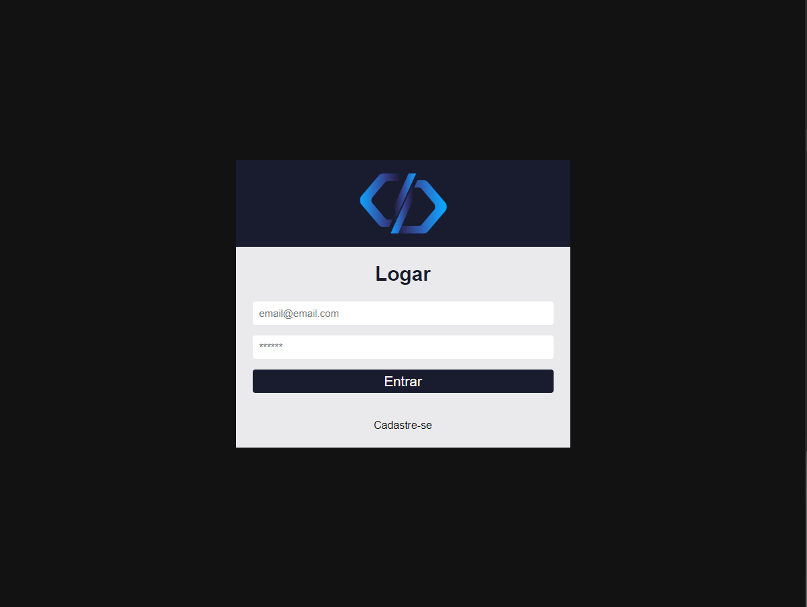
  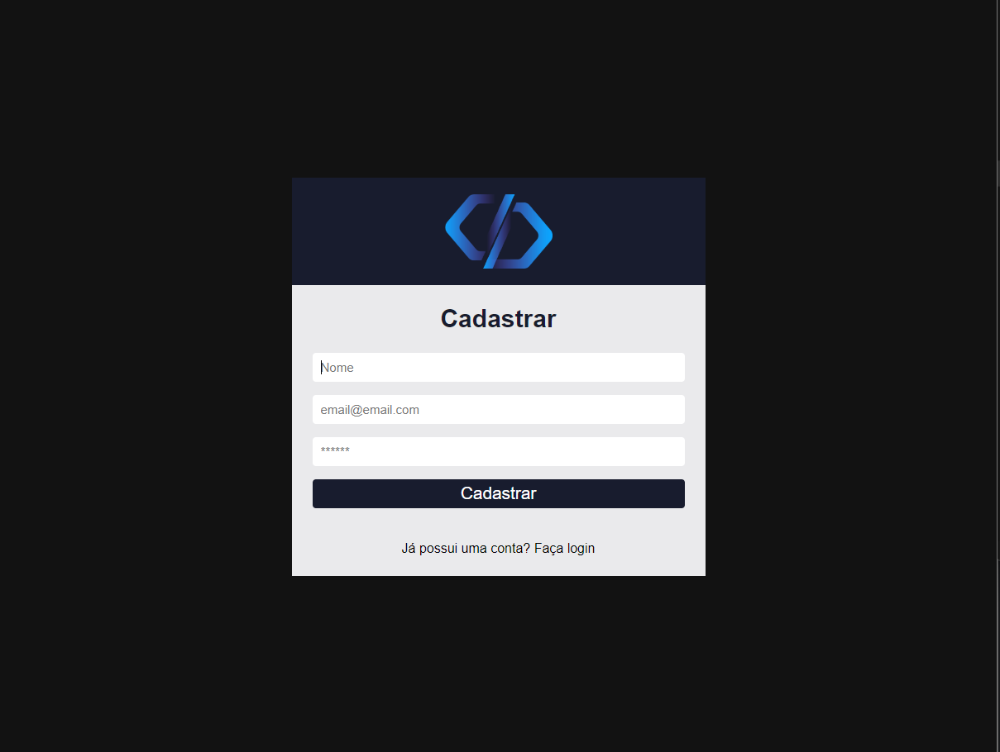
  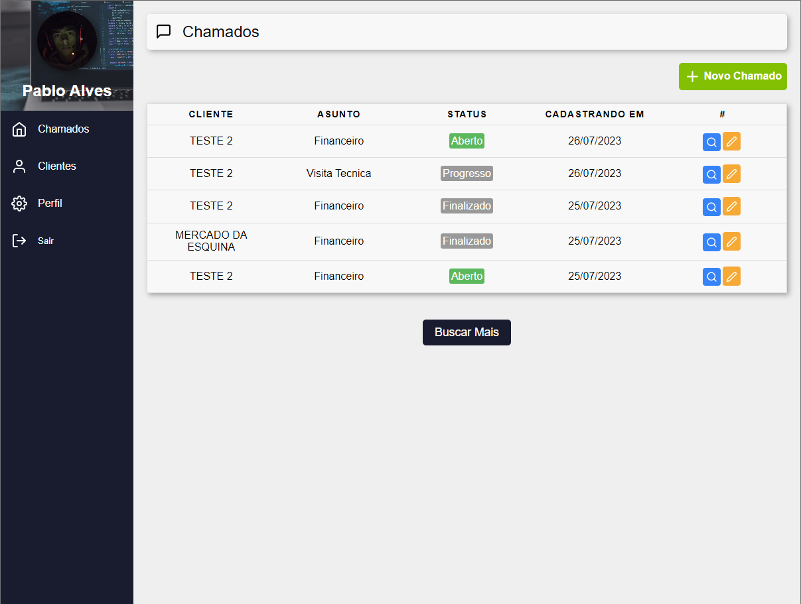

  

  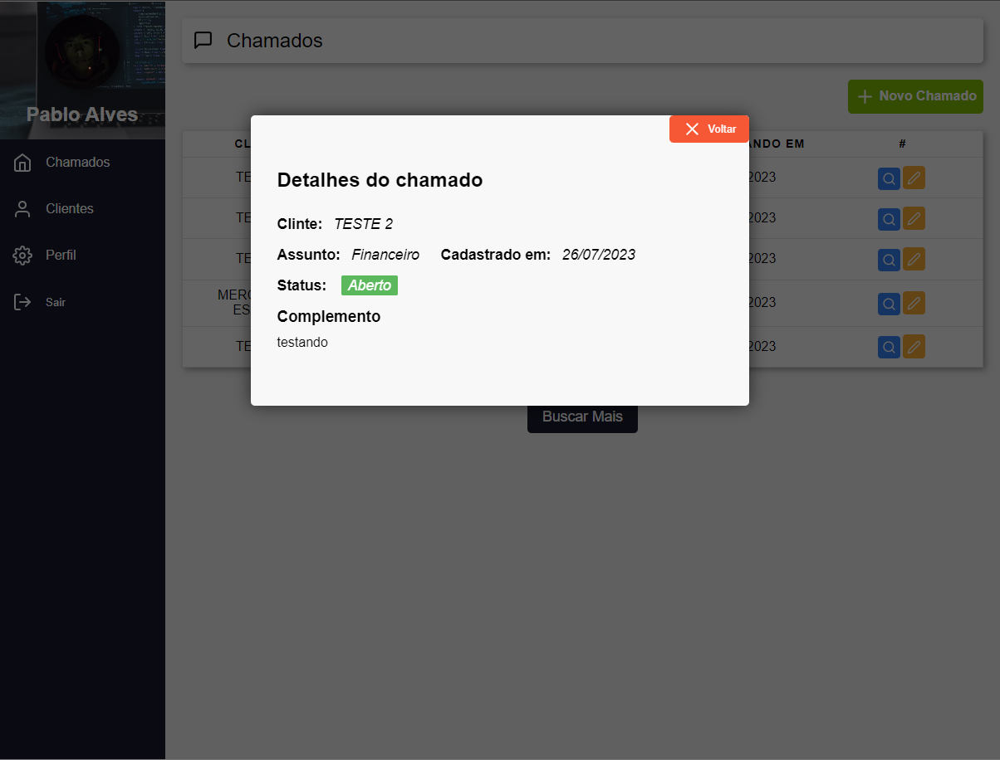
  
  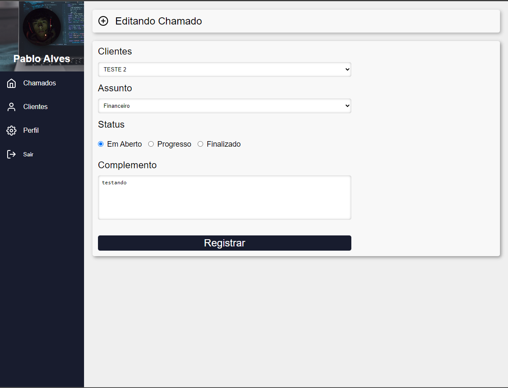

  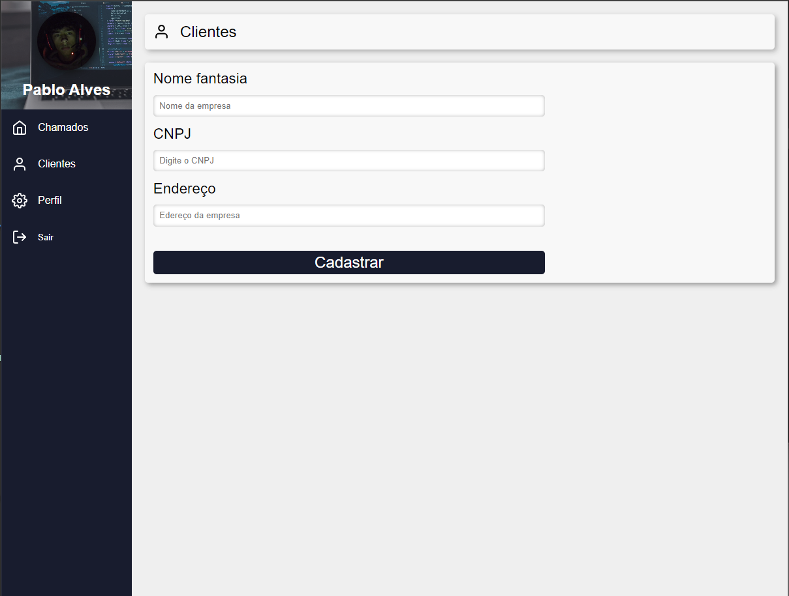
  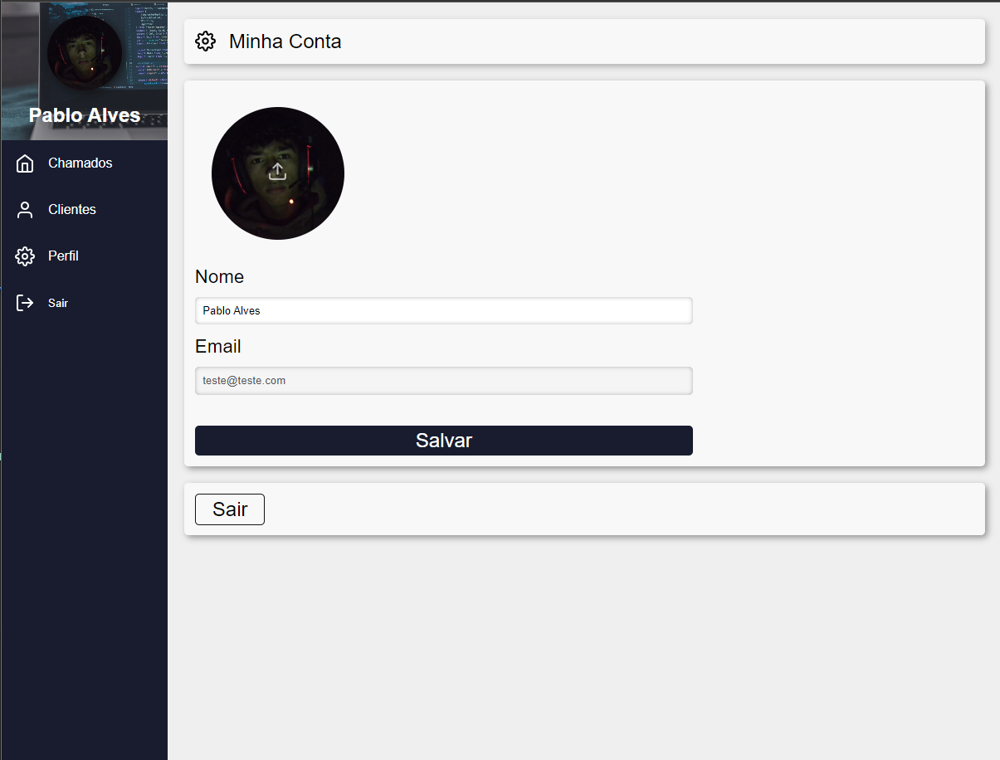
  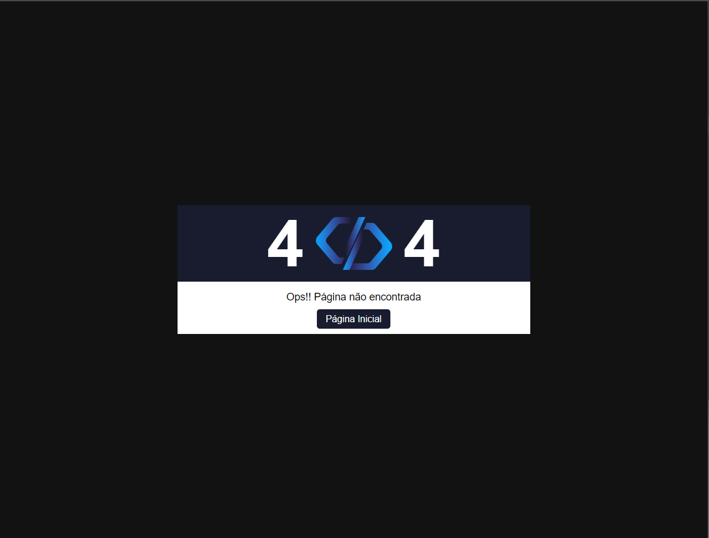

  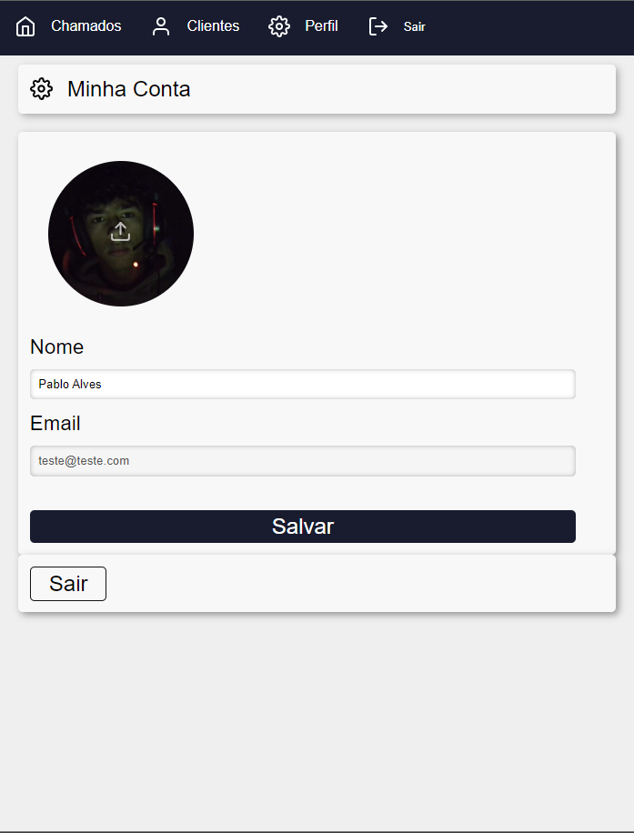
  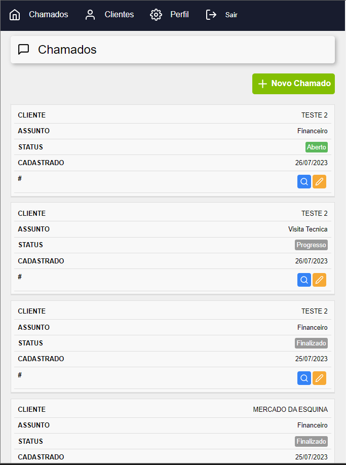
  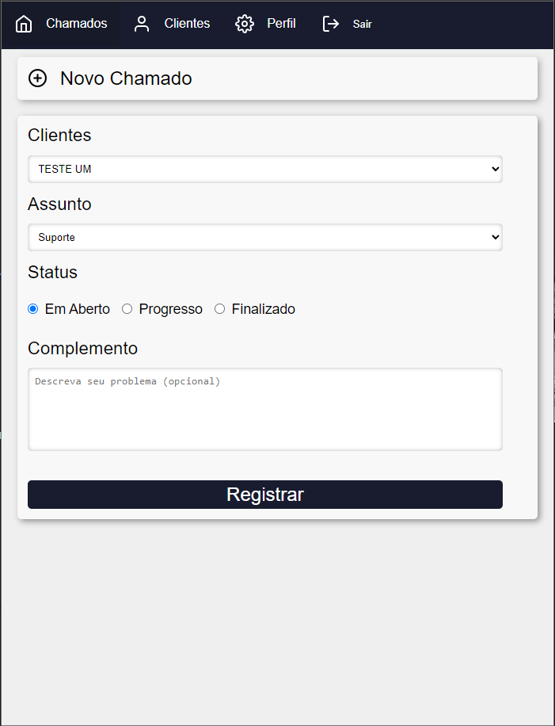
  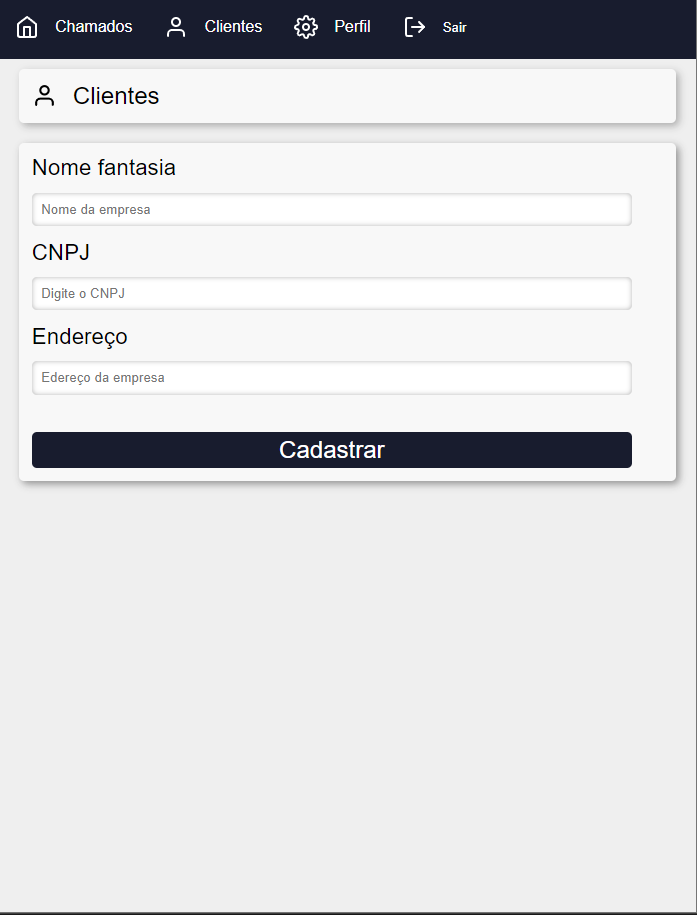

## 🛠️ Construído com

## 📌 Sobre o Projeto
É um sistema que gerência chamados, clientes e usuários, com sistema de login e busca de acordo com o limite programado.
Desenvolvido juntamente com o Matheus Fraga do curso Fábrica de Aplicativos,
com alguns detalhes amais como: nome abaixo do perfil,
botão de logout no header,
algumas estilizações pessoais,
e validações ao gerênciar novos clientes.

